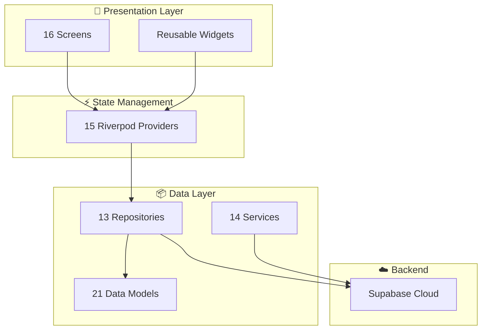

# 🐟 AquaStock Pro - Complete Application Documentation

> A comprehensive Flutter POS (Point of Sale) application with admin dashboard, inventory management, and multi-platform support.

---

## 📱 Application Overview

| Aspect | Details |
|--------|---------|
| **App Name** | AquaStock Pro |
| **Platform** | Flutter (Android, iOS, Windows, macOS, Web) |
| **SDK Version** | Dart ^3.10.4 |
| **State Management** | Flutter Riverpod |
| **Backend** | Supabase (Cloud Database) |
| **Architecture** | Feature-first with Repository Pattern |
| **Version** | 1.0.0+1 |

---

## 🏗️ Architecture Overview



---

## 📂 Project Structure

```
lib/
├── 📄 main.dart                    # App entry point
├── 🎨 app/
│   └── theme/                      # Theming system
│       ├── app_colors.dart         # Color palette
│       ├── app_text_styles.dart    # Typography
│       └── app_theme.dart          # Theme configuration
├── 🔧 core/
│   ├── constants/                  # App constants
│   ├── services/                   # Core services
│   └── widgets/                    # 6 Reusable UI widgets
├── 📦 data/
│   ├── models/                     # 21 Data models
│   ├── repositories/               # 13 Repositories
│   └── services/                   # 14 Services
├── 🚀 features/                    # Feature modules
│   ├── auth/                       # Authentication
│   ├── categories/                 # Category management
│   ├── customers/                  # Customer management
│   ├── dashboard/                  # Analytics dashboard
│   ├── employees/                  # Employee management
│   ├── inventory/                  # Stock management
│   ├── onboarding/                 # Setup wizard
│   ├── orders/                     # Order history
│   ├── pos/                        # Point of Sale (Core)
│   ├── products/                   # Product management
│   ├── purchase_orders/            # Purchase orders
│   ├── reports/                    # Report generation
│   ├── settings/                   # App settings
│   ├── shell/                      # Main navigation
│   └── suppliers/                  # Supplier management
└── ⚡ providers/                   # 15 Riverpod providers
```

---

## 📊 All Screens (16 Total)

### 🔐 1. Authentication & Onboarding

| Screen | File | Features |
|--------|------|----------|
| **Splash Screen** | `lib/features/auth/screens/splash_screen.dart` | App initialization, auth check |
| **Login Screen** | `lib/features/auth/screens/login_screen.dart` | User authentication, biometric login |
| **Setup Wizard** | `lib/features/onboarding/screens/setup_wizard_screen.dart` | Business setup flow |

**Onboarding Steps:**
| Step | File | Description |
|------|------|-------------|
| Welcome | `welcome_step.dart` | App introduction |
| Business Info | `business_info_step.dart` | Store name, address, contact |
| Admin Setup | `admin_setup_step.dart` | Admin account creation |
| Tax & Currency | `tax_currency_step.dart` | GST, currency settings |
| Completion | `completion_step.dart` | Setup confirmation |

---

### 📈 2. Dashboard (Analytics)

| Screen | File | Lines |
|--------|------|-------|
| **Dashboard** | `lib/features/dashboard/screens/dashboard_screen.dart` | 798 |

**Components:**
| Component | Description |
|-----------|-------------|
| `_DateRangeSelector` | Date range filtering (Today, Week, Month, Custom) |
| `_SalesChart` | Sales visualization using fl_chart |
| `_TopProducts` | Best selling products ranking |
| `_RecentOrders` | Latest transactions list |
| `_QuickStats` | Key metrics cards |

**Features:**
- ✅ Real-time sales statistics
- ✅ Interactive date range filtering
- ✅ Sales trend charts with animations
- ✅ Top products ranking
- ✅ Recent orders with status indicators
- ✅ Pull-to-refresh functionality
- ✅ Responsive layout (mobile/desktop)

---

### 🛒 3. Point of Sale (POS) - Core Feature

| Screen | File | Lines | Size |
|--------|------|-------|------|
| **POS Screen** | `lib/features/pos/screens/pos_screen.dart` | 1,062 | 41 KB |

**POS Widgets:**

| Widget | File | Size | Purpose |
|--------|------|------|---------|
| 💳 Payment Dialog | `payment_dialog.dart` | 75 KB | Payment processing, receipt |
| 🛒 Cart Panel | `cart_panel.dart` | 36 KB | Cart management |
| 📱 Mobile Cart | `mobile_cart_sheet.dart` | 19 KB | Mobile cart view |
| 📦 Product Grid | `product_grid.dart` | 10 KB | Product display grid |
| 📂 Category Sidebar | `category_sidebar.dart` | 8 KB | Category navigation |
| 🏷️ Category Tabs | `category_tabs.dart` | 2 KB | Tab navigation |

**Key Functions:**
```dart
_addToCart(product)              // Add products to cart
_findAndAddProductByBarcode()    // Barcode scanning
_showPaymentDialog()             // Process payment
_saveOrder()                     // Save completed order
_holdOrder()                     // Hold current order
_clearCart()                     // Reset cart
_buildMobileLayout()             // Mobile responsive UI
_buildDesktopLayout()            // Desktop responsive UI
```

**POS Features:**
- ✅ Barcode scanner integration (mobile_scanner)
- ✅ Product search with filters
- ✅ Category-based filtering
- ✅ Cart management (add/remove/quantity)
- ✅ Discount codes application
- ✅ Order notes for special requests
- ✅ Multiple payment methods (Cash, Card, UPI)
- ✅ Hold orders for later
- ✅ Receipt generation & printing
- ✅ Responsive design (mobile/tablet/desktop)

---

### 📦 4. Inventory Management

| Screen | File | Lines |
|--------|------|-------|
| **Inventory** | `lib/features/inventory/screens/inventory_screen.dart` | 430 |
| **Stock Adjustment Dialog** | `lib/features/inventory/widgets/stock_adjustment_dialog.dart` | - |

**Tabs:**
| Tab | Description |
|-----|-------------|
| 🔴 Low Stock | Products below minimum threshold |
| 📦 All Products | Complete inventory list |
| 📝 Adjustments | Stock adjustment history |

**Features:**
- ✅ Stock level monitoring
- ✅ Low stock alerts
- ✅ Stock adjustments (add/remove)
- ✅ Adjustment history with reasons
- ✅ Search and filter

---

### 🏷️ 5. Products & Categories

| Screen | File | Description |
|--------|------|-------------|
| **Products** | `lib/features/products/screens/products_screen.dart` | Product listing & CRUD |
| **Product Form** | `lib/features/products/screens/product_form_screen.dart` | Add/Edit products |
| **Categories** | `lib/features/categories/screens/categories_screen.dart` | Category management |

**Product Features:**
- ✅ Product CRUD operations
- ✅ Barcode assignment
- ✅ Category assignment
- ✅ Multiple variants support
- ✅ Image upload
- ✅ Price & cost tracking
- ✅ Stock quantity management

---

### 📋 6. Orders & Transactions

| Screen | File | Description |
|--------|------|-------------|
| **Orders** | `lib/features/orders/screens/orders_screen.dart` | Order history |

**Features:**
- ✅ Order listing with pagination
- ✅ Status filtering (Completed, Pending, Refunded)
- ✅ Order details view
- ✅ Receipt printing
- ✅ Refund processing
- ✅ Search by order ID

---

### 📊 7. Reports & Analytics

| Screen | File | Lines | Size |
|--------|------|-------|------|
| **Reports** | `lib/features/reports/screens/reports_screen.dart` | 1,248 | 49 KB |

**Report Types:**
| Report | Description |
|--------|-------------|
| 💰 Sales Report | Revenue, orders, payment methods |
| 📦 Product Report | Product performance, sales volume |
| 📂 Category Report | Category-wise sales analysis |
| 👥 Customer Report | Customer purchase history |
| 💳 Payment Methods | Payment method distribution |
| 🧾 Tax Report | GST/Tax collection summary |

**Export Formats:**
| Format | Library |
|--------|---------|
| 📄 PDF | pdf package |
| 📊 Excel | excel package |
| 📝 CSV | csv package |

**Components:**
| Component | Description |
|-----------|-------------|
| `_DateRangeSelector` | Date range selection with presets |
| `_EnhancedReportCard` | Interactive report cards |
| `_ReportExportDialog` | Export configuration dialog |
| `_QuickExportDialog` | Quick export options |

---

### ⚙️ 8. Settings & Configuration

| Screen | File | Lines | Size |
|--------|------|-------|------|
| **Settings** | `lib/features/settings/screens/settings_screen.dart` | 1,919 | 73 KB |

**Settings Sections:**
| Section | Description |
|---------|-------------|
| 🏢 Business Info | Store name, address, contact, GSTIN |
| 💰 Tax Settings | GST rates, tax configuration |
| 💱 Currency | Currency symbol, format |
| 🧾 Receipt | Receipt customization |
| 🎁 Loyalty | Customer loyalty program |
| 📱 SMS | SMS notification settings |
| 🎨 Theme | Light/Dark/System theme |
| 🖼️ Logo | Business logo upload |
| 🚪 Logout | Sign out option |

**Dialogs:**
```dart
_BusinessInfoDialog     // Edit business details
_TaxSettingsDialog      // Configure tax rates
_CurrencyDialog         // Currency settings
_ReceiptSettingsDialog  // Receipt customization
_LoyaltySettingsDialog  // Loyalty program config
_SmsSettingsDialog      // SMS API settings
```

---

### 👥 9. People Management

| Screen | File | Description |
|--------|------|-------------|
| **Customers** | `lib/features/customers/screens/customers_screen.dart` | Customer profiles & credit |
| **Employees** | `lib/features/employees/screens/employees_screen.dart` | Staff management |
| **Suppliers** | `lib/features/suppliers/screens/suppliers_screen.dart` | Vendor management |

---

### 📝 10. Purchase Orders

| Screen | File | Description |
|--------|------|-------------|
| **Purchase Orders** | `lib/features/purchase_orders/screens/purchase_orders_screen.dart` | PO management |

---

## 📦 Data Models (21 Total)

| Model | File | Description |
|-------|------|-------------|
| 👤 User | `user.dart` | User account data |
| 📦 Product | `product.dart` | Product information |
| 📂 Category | `category.dart` | Product categories |
| 🧾 Order | `order.dart` | Sales orders |
| 📝 OrderItem | `order_item.dart` | Order line items |
| 👥 Customer | `customer.dart` | Customer profiles |
| 👨‍💼 Employee | `employee.dart` | Employee data |
| 🏭 Supplier | `supplier.dart` | Supplier information |
| 🎫 Discount | `discount.dart` | Discount codes |
| 📋 PurchaseOrder | `purchase_order.dart` | Purchase orders |
| 📊 StockAdjustment | `stock_adjustment.dart` | Stock changes |
| 💸 Refund | `refund.dart` | Refund records |
| 📝 RefundItem | `refund_item.dart` | Refund line items |
| ⚙️ BusinessSettings | `business_settings.dart` | App configuration |
| 🏪 Store | `store.dart` | Store information |
| 📦 ProductBatch | `product_batch.dart` | Batch tracking |
| 🔀 ProductVariant | `product_variant.dart` | Product variants |
| 📜 InventoryLog | `inventory_log.dart` | Inventory history |
| 💳 CreditTransaction | `credit_transaction.dart` | Credit tracking |
| 🔄 StockTransfer | `stock_transfer.dart` | Stock transfers |
| 📋 AuditLog | `audit_log.dart` | Audit trail |

---

## 🔧 Services (14 Total)

| Service | File | Size | Purpose |
|---------|------|------|---------|
| ☁️ Supabase | `supabase_service.dart` | 4 KB | Cloud database connection |
| 🌐 Connectivity | `connectivity_service.dart` | 2 KB | Network status monitoring |
| 🧾 Receipt | `receipt_service.dart` | 12 KB | Receipt generation |
| 📄 PDF Invoice | `pdf_invoice_service.dart` | 20 KB | PDF invoice creation |
| 🧾 GST Invoice | `gst_invoice_service.dart` | 13 KB | GST-compliant invoices |
| 📊 Report Export | `report_export_service.dart` | 21 KB | Report generation |
| 📤 Export | `export_service.dart` | 9 KB | Data export (Excel/CSV) |
| 📷 Barcode Scanner | `barcode_scanner_service.dart` | 7 KB | Barcode scanning |
| 📱 SMS | `sms_service.dart` | 11 KB | SMS notifications |
| 💬 WhatsApp | `whatsapp_service.dart` | 8 KB | WhatsApp sharing |
| 💳 UPI | `upi_service.dart` | 6 KB | UPI payment integration |
| 💾 Backup | `backup_service.dart` | 6 KB | Data backup |
| 🔐 Biometric | `biometric_service.dart` | 4 KB | Fingerprint/Face ID |
| 🔑 Password | `password_service.dart` | 4 KB | Password management |

---

## 🗄️ Repositories (13 Total)

| Repository | File | Size | Description |
|------------|------|------|-------------|
| 📚 Base | `base_repository.dart` | 3 KB | Base class |
| 👤 User | `user_repository.dart` | 7 KB | User operations |
| 📦 Product | `product_repository.dart` | 11 KB | Product CRUD |
| 📂 Category | `category_repository.dart` | 4 KB | Category CRUD |
| 🧾 Order | `order_repository.dart` | 11 KB | Order operations |
| 👥 Customer | `customer_repository.dart` | 10 KB | Customer CRUD |
| 👨‍💼 Employee | `employee_repository.dart` | 5 KB | Employee CRUD |
| 🏭 Supplier | `supplier_repository.dart` | 4 KB | Supplier CRUD |
| 🎫 Discount | `discount_repository.dart` | 5 KB | Discount management |
| 📋 PurchaseOrder | `purchase_order_repository.dart` | 6 KB | PO management |
| 📊 StockAdjustment | `stock_adjustment_repository.dart` | 5 KB | Stock operations |
| 💸 Refund | `refund_repository.dart` | 6 KB | Refund processing |
| ⚙️ Settings | `settings_repository.dart` | 5 KB | Settings storage |

---

## ⚡ State Providers (15 Total)

| Provider | File | Size | Purpose |
|----------|------|------|---------|
| 🔐 Auth | `auth_provider.dart` | 6 KB | Authentication state |
| 🛒 Cart | `cart_provider.dart` | 6 KB | Shopping cart state |
| 📦 Products | `products_provider.dart` | 4 KB | Product state |
| 📂 Categories | `categories_provider.dart` | 3 KB | Category state |
| 👥 Customers | `customers_provider.dart` | 4 KB | Customer state |
| 🧾 Orders | `orders_provider.dart` | 4 KB | Order state |
| 📈 Dashboard | `dashboard_provider.dart` | 5 KB | Dashboard stats |
| 👨‍💼 Employees | `employees_provider.dart` | 2 KB | Employee state |
| 🎫 Discounts | `discounts_provider.dart` | 6 KB | Discount state |
| 💸 Refunds | `refunds_provider.dart` | 8 KB | Refund state |
| 🏭 Suppliers | `suppliers_provider.dart` | 2 KB | Supplier state |
| 📋 PurchaseOrders | `purchase_orders_provider.dart` | 3 KB | PO state |
| 📊 StockAdjustment | `stock_adjustment_provider.dart` | 2 KB | Stock state |
| ⚙️ Settings | `settings_provider.dart` | 3 KB | App settings state |
| 🎨 Theme | `theme_provider.dart` | 2 KB | Theme state |

---

## 🎨 Core Widgets (6 Total)

| Widget | File | Size | Purpose |
|--------|------|------|---------|
| 🔘 AppButton | `app_button.dart` | 5 KB | Styled button component |
| 🃏 AppCard | `app_card.dart` | 4 KB | Card container |
| ✏️ AppTextField | `app_text_field.dart` | 5 KB | Input field component |
| 📊 StatsCard | `stats_card.dart` | 19 KB | Statistics display card |
| 📭 EmptyState | `empty_state.dart` | 4 KB | Empty state placeholder |
| ⏳ LoadingOverlay | `loading_overlay.dart` | 2 KB | Loading indicator |

---

## 📚 Dependencies (30+)

### 🔧 Core
```yaml
flutter_riverpod: ^2.4.9      # State management
supabase_flutter: ^2.3.4      # Cloud backend
```

### 🎨 UI & Styling
```yaml
iconsax: ^0.0.8               # Premium icons
fl_chart: ^0.66.2             # Charts & graphs
google_fonts: ^6.1.0          # Typography
flutter_svg: ^2.0.9           # SVG support
flutter_animate: ^4.5.0       # Animations
quickalert: ^1.1.0            # Alert dialogs
```

### 🔧 Utilities
```yaml
intl: ^0.19.0                 # Internationalization
uuid: ^4.3.3                  # Unique IDs
path: ^1.8.3                  # File paths
path_provider: ^2.1.2         # Directory access
shared_preferences: ^2.2.2    # Local storage
connectivity_plus: ^5.0.2     # Network status
```

### 📄 Documents & Export
```yaml
pdf: ^3.10.8                  # PDF generation
printing: ^5.12.0             # Print support
excel: ^4.0.2                 # Excel export
csv: ^6.0.0                   # CSV export
file_picker: ^8.0.0+1         # File selection
```

### 📡 Communication
```yaml
url_launcher: ^6.2.4          # URL handling
share_plus: ^7.2.1            # Share functionality
http: ^1.2.0                  # HTTP requests
```

### 📷 Features
```yaml
mobile_scanner: ^5.1.1        # Barcode scanning
image_picker: ^1.2.1          # Image selection
local_auth: ^2.2.0            # Biometric auth
flutter_local_notifications: ^17.0.0  # Notifications
permission_handler: ^11.3.0   # Permissions
```

### 🔐 Security
```yaml
crypto: ^3.0.3                # Cryptography
flutter_secure_storage: ^9.0.0  # Secure storage
flutter_dotenv: ^5.1.0        # Environment config
```

---

## 📈 Code Statistics

### Summary
| Metric | Count |
|--------|-------|
| **Total Screens** | 16 |
| **Total Data Models** | 21 |
| **Total Services** | 14 |
| **Total Repositories** | 13 |
| **Total Providers** | 15 |
| **Total Core Widgets** | 6 |
| **POS Widgets** | 6 |
| **Onboarding Steps** | 5 |
| **Dependencies** | 30+ |
| **lib/ Files** | 110+ |

### Largest Files (by size)
| Rank | File | Size |
|------|------|------|
| 1️⃣ | `payment_dialog.dart` | 75 KB |
| 2️⃣ | `settings_screen.dart` | 73 KB |
| 3️⃣ | `reports_screen.dart` | 49 KB |
| 4️⃣ | `pos_screen.dart` | 41 KB |
| 5️⃣ | `cart_panel.dart` | 36 KB |
| 6️⃣ | `dashboard_screen.dart` | 31 KB |

### Lines of Code (major screens)
| Screen | Lines |
|--------|-------|
| Settings | 1,919 |
| Reports | 1,248 |
| POS | 1,062 |
| Dashboard | 798 |
| Inventory | 430 |

---

## ✅ Complete Feature Checklist

### 🔐 Authentication
- [x] User login/logout
- [x] Biometric authentication (fingerprint/face)
- [x] Session management
- [x] Password security

### 🏢 Business Setup
- [x] Onboarding wizard
- [x] Business info configuration
- [x] Tax settings (GST)
- [x] Currency configuration
- [x] Logo upload

### 🛒 Point of Sale
- [x] Product grid display
- [x] Category filtering
- [x] Product search
- [x] Barcode scanning
- [x] Cart management
- [x] Quantity adjustment
- [x] Discount codes
- [x] Order notes
- [x] Hold orders
- [x] Multiple payment methods
- [x] Receipt generation
- [x] Receipt printing

### 📦 Inventory
- [x] Stock monitoring
- [x] Low stock alerts
- [x] Stock adjustments
- [x] Adjustment history
- [x] Product variants

### 📊 Reports
- [x] Sales reports
- [x] Product reports
- [x] Category reports
- [x] Customer reports
- [x] Payment method reports
- [x] Tax reports
- [x] PDF export
- [x] Excel export
- [x] CSV export
- [x] Date range filtering

### 👥 Management
- [x] Customer management
- [x] Employee management
- [x] Supplier management
- [x] Purchase orders

### 📱 Communication
- [x] SMS notifications
- [x] WhatsApp integration
- [x] Receipt sharing

### 💳 Payments
- [x] Cash payment
- [x] Card payment
- [x] UPI payment
- [x] Multiple payment split

### 🎨 UI/UX
- [x] Dark/Light theme
- [x] System theme sync
- [x] Responsive design
- [x] Mobile layout
- [x] Desktop layout
- [x] Tablet layout
- [x] Pull-to-refresh
- [x] Loading states
- [x] Error handling
- [x] Empty states

### 🌐 Multi-Platform
- [x] Android
- [x] iOS
- [x] Windows
- [x] macOS
- [x] Web

---

## 🔗 Quick Links

### Core Screens
- [POS Screen](lib/features/pos/screens/pos_screen.dart)
- [Dashboard](lib/features/dashboard/screens/dashboard_screen.dart)
- [Reports](lib/features/reports/screens/reports_screen.dart)
- [Settings](lib/features/settings/screens/settings_screen.dart)
- [Inventory](lib/features/inventory/screens/inventory_screen.dart)

### Key Services
- [Report Export](lib/data/services/report_export_service.dart)
- [PDF Invoice](lib/data/services/pdf_invoice_service.dart)
- [Receipt Service](lib/data/services/receipt_service.dart)
- [SMS Service](lib/data/services/sms_service.dart)

### Configuration
- [App Theme](lib/app/theme/app_theme.dart)
- [App Constants](lib/core/constants/app_constants.dart)
- [Environment](.env)

---

*📅 Documentation generated: January 10, 2026*
*🔄 Version: 1.0.0*
